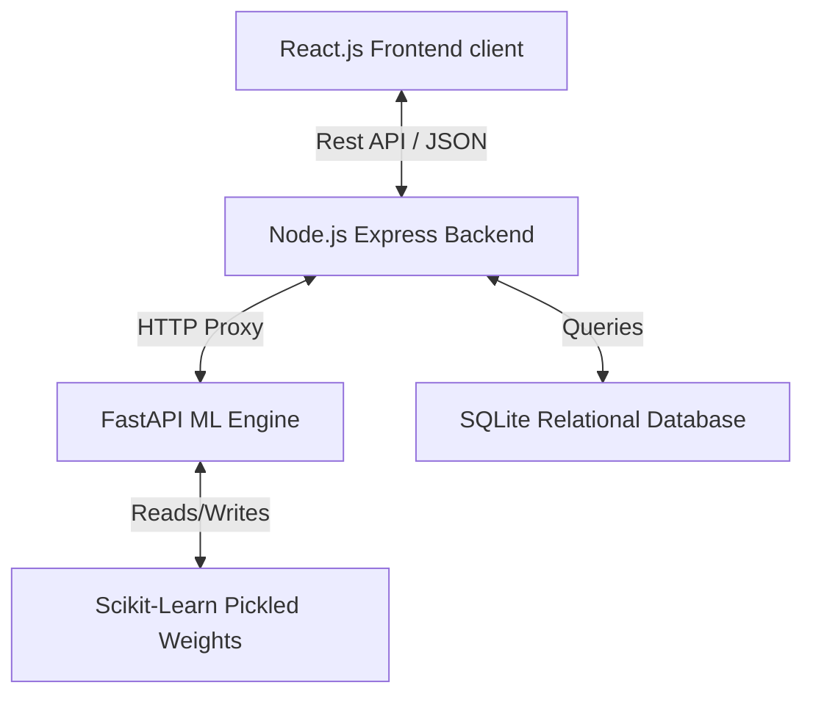

# FraudShield: Bank-Grade Fraud Detection & Account Auditing Platform

**FraudShield** is a professional, final-year academic project web application that enables financial account monitoring, money transfer auditing, and smart bank statement transaction parsing. It integrates rule-based heuristic filters with machine learning algorithms (Isolation Forest and Random Forest) to evaluate transaction risk in real time.

---

## Key Features

1. **Secure Session Authorization**: Secure authentication with JWT authorization tokens, password complexity checks, and simulated Two-Factor Authentication (2FA) with real-time console verification codes.
2. **Premium Neo-Bank Portfolios**: Manage linked accounts (Checking, Savings, Credit Cards, and Investment portfolios) with credit card card designs, virtual SIM chips, and primary switch parameters.
3. **Universal Bank Statement Parser**: Parses financial statements (CSV, XLS, PDF tables) using a fuzzy header column mapper cache fallback screen.
4. **Pre-Transaction ML Auditing**: Real-time money transfers feature immediate risk scoring with warning logs and customizable user override configurations.
5. **Interactive Fraud Center**: Allows auditors to approve or flag transactions. Submitting feedback triggers the ML microservice to retrain model weights, update metrics (Accuracy, Precision, Recall, F1), and record log improvements.
6. **Sleek Glassmorphic Dashboards**: Responsive analytics displaying spend distribution pie charts, balance trend area graphs, and key security action lists.

---

## Technical Architecture

The platform operates on a modular, three-tier architecture:



### Stack Detail
- **Client Interface**: React.js (Vite) + Tailwind CSS + Lucide Icons + Recharts
- **Core Server API**: Node.js + Express.js + SQLite3 database
- **Artificial Intelligence Engine**: Python 3.12 + FastAPI + Scikit-Learn + Pandas + Numpy

---

## Directory Map

- `/backend`: Core REST API, JWT middlewares, SQLite schema initializers, and mock data seeder.
- `/ml-engine`: FastAPI endpoints, preprocessing pipelines, model serialization models, and retrain controllers.
- `/frontend`: Responsive dashboard layouts, global AuthContext states, page templates, and template CSV downloads.

---

## Installation & Getting Started

Follow these steps to run all services concurrently:

### Prerequisites
- [Node.js](https://nodejs.org/) (v18+ recommended)
- [Python](https://www.python.org/) (v3.10+ recommended)

---

### Step 1: Initialize the Machine Learning Service
1. Navigate to `/ml-engine`:
   ```bash
   cd ml-engine
   ```
2. Build virtual environment and activate:
   - **Windows**: `python -m venv venv` and `venv\Scripts\activate`
   - **Mac/Linux**: `python3 -m venv venv` and `source venv/bin/activate`
3. Install dependencies:
   ```bash
   pip install -r requirements.txt
   ```
4. Start the service (runs on port `8001` to prevent port collisions):
   ```bash
   uvicorn app.main:app --host 127.0.0.1 --port 8001 --reload
   ```

---

### Step 2: Initialize the Node.js API Backend
1. Navigate to `/backend`:
   ```bash
   cd ../backend
   ```
2. Install dependencies:
   ```bash
   npm install
   ```
3. Initialize the server (automatically constructs schemas and seeds the SQLite `database.db` on first run):
   ```bash
   npm run start
   ```

---

### Step 3: Initialize the Vite React Frontend
1. Navigate to `/frontend`:
   ```bash
   cd ../frontend
   ```
2. Install dependencies:
   ```bash
   npm install
   ```
3. Start the bundler:
   ```bash
   npm run dev
   ```
4. Access the portal at [http://localhost:5173/](http://localhost:5173/) in your web browser.

---

## Demonstration Credentials

Log in using the pre-seeded academic profile:

- **Email Address**: `demo@fraudshield.com`
- **Password**: `Password@123`
- **2FA OTP Code**: Retrieve the 6-digit code printed directly inside your Node.js backend console output upon submitting credentials!

---

## Running Verification Suites

You can execute automated testing scripts in each directory:

- **ML Pipeline verification**: In `/ml-engine`, run `venv\Scripts\python test_ml_pipeline.py`.
- **Database & Seeder verification**: In `/backend`, run `node test_backend.js`.
